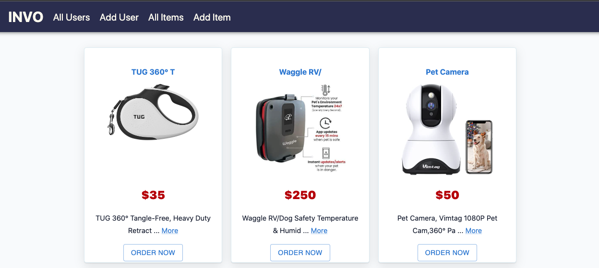
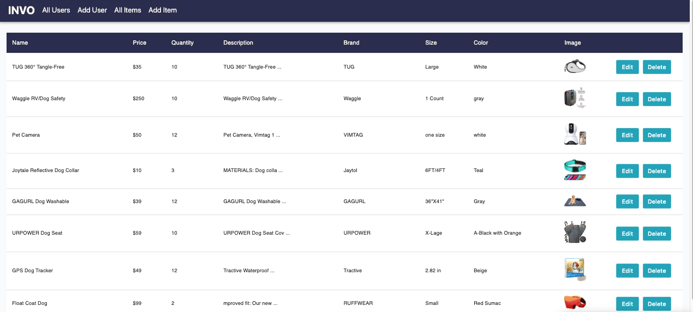
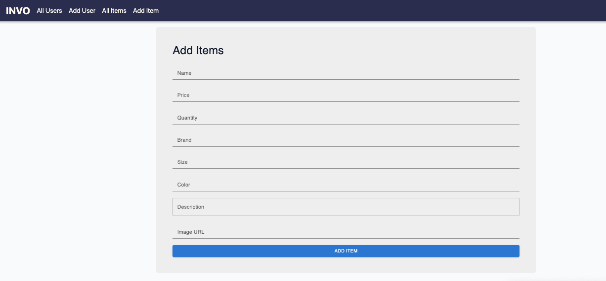

# Inventory react-app.

This application is a simple inventory product system, created using ReactJS app, NodeJS and Material ui  . In this app, you can add new products and category to stock, which can be used to monitor all available items. You are also able to see amounts of present item and details of actions conducted on every products, such as adding, edit and removing items and users. 

> ## Requirements
```bash
 1. Node/NPM
 2. React Js
 3. Material ui
 4. Html/CSS
```
## Installation

### Clone the project 

### Github link Backend :
```bash
https://github.com/ouberka021/express-app.git
```

### Github link Frontend :
```bash
https://github.com/ouberka021/react-invt-app.git
```
Heroku link
```bash
https://invt-pro.herokuapp.com/
``` 

### Install my-project using ReactJS framework.

```bash
  npx create react app
  npm start
  
```
  ### This is package.json
  ```bash
     "@emotion/react": "^11.10.4",
    "@emotion/styled": "^11.10.4",
    "@mui/material": "^5.10.4",
    "@testing-library/jest-dom": "^5.16.5",
    "@testing-library/react": "^13.4.0",
    "@testing-library/user-event": "^13.5.0",
    "axios": "^0.27.2",
    "react": "^18.2.0",
    "react-dom": "^18.2.0",
    "react-router-dom": "^6.3.0",
    "react-scripts": "5.0.1",
```
## Application demo

### Home page


### List Product

### New product



    
## Support
```bash
For support, email ouberka021@gmail.com.com .
```
